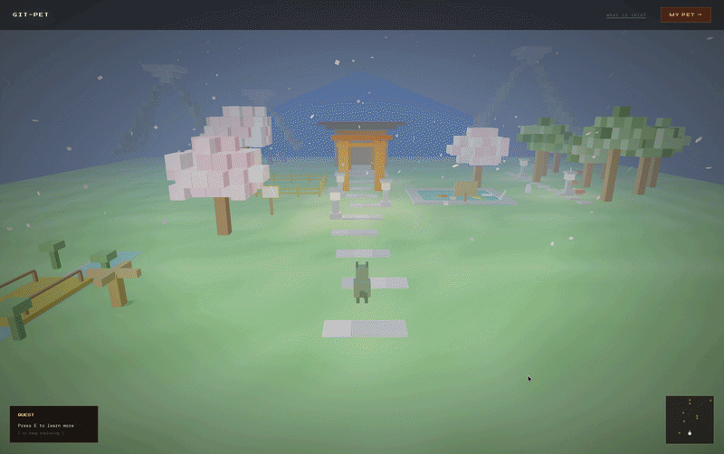

<div align="center">

```
 ██████╗ ██╗████████╗    ██████╗ ███████╗████████╗
██╔════╝ ██║╚══██╔══╝    ██╔══██╗██╔════╝╚══██╔══╝
██║  ███╗██║   ██║       ██████╔╝█████╗     ██║   
██║   ██║██║   ██║       ██╔═══╝ ██╔══╝     ██║   
╚██████╔╝██║   ██║       ██║     ███████╗   ██║   
 ╚═════╝ ╚═╝   ╚═╝       ╚═╝     ╚══════╝   ╚═╝   
```

### Your GitHub activity, alive — inside a multiplayer 3D world.

🧩 Open Source • Contributions Welcome

🌍 Walk into a world where developers are pets.  
💻 Your commits shape your identity.  
🤝 Interact, explore, and build together.

🔗 **Live Demo:** https://git-pet-beta.vercel.app/



<p><strong>Live multiplayer. Real developers. Real-time interactions.</strong></p>

</div>

---

## 🚀 What is Git-Pet?

Git-Pet turns your GitHub activity into a **living presence inside a shared 3D world**.

Instead of:
> commit → graph → forget

You get:
> commit → identity → interaction → world


---

## 🎮 Features

### 🌐 Multiplayer World

* See other developers in real-time
* Each player is represented by their unique pet
* Smooth interpolation-based movement


---

### 🐾 Dynamic Pet Identity

* Pet type linked to your profile
* Visual identity tied to developer data
* Persistent across sessions

---

### 🤝 Interaction System

* Proximity-based interactions
* Actions:

  * 😊 Emojis
  * ⚔️ Fight (WIP animations)
  * 🤝 Befriend
  * 🎁 Gift
* Real-time feedback between players

---

### 🌍 Expanding Game World

* Multiple zones (forest, desert, mountains, plains)
* Connected paths for exploration
* Environmental elements (trees, rocks, terrain variation)
* Fog + depth for immersion

---

### 🎮 Gameplay Systems

* Smooth player movement + collision system
* Third-person camera
* Zone-based world design

---

## 🧠 Built with AI-assisted workflows

Git-Pet is built using AI-assisted development workflows:

* Rapid prototyping of complex systems  
* Debugging real-time multiplayer issues  
* Designing interaction systems faster  
* Iterating from idea → working feature in hours  

The focus is not just using AI, but using it to **shorten the build loop** and ship faster.

Goal:
> Turn developer data → into behavior → into experience

---

## ⚙️ Tech Stack

**Frontend & 3D**

* Next.js (App Router)
* React
* Three.js (custom world engine inside RAF loop)

**Backend**

* Node.js + Express
* WebSockets (real-time multiplayer)

**Auth & Data**

* NextAuth (GitHub OAuth)
* GitHub APIs

**Database**

* Upstash
* Redis

**Deployment**  

* Vercel

---

## 🧱 Architecture

* Custom lightweight 3D engine (no external game engine)
* Single RAF loop controlling:

  * movement
  * rendering
  * multiplayer updates
* Ref-based state for performance
* Instanced meshes for optimization

---

## 🛠️ Running Locally

### 1. Clone

```bash
git clone https://github.com/SaadArqam/git-pet.git
cd git-pet
npm install
```

---

### 2. Setup Environment

Create:

```bash
apps/web/.env.local
```

```env
NEXTAUTH_URL=http://localhost:3000
NEXTAUTH_SECRET=your_secret

GITHUB_CLIENT_ID=your_client_id
GITHUB_CLIENT_SECRET=your_client_secret
```

---

### 3. Run

```bash
npm run dev
```

Open:

```
http://localhost:3000
```

---

## 🧪 Current Focus

* Improving movement feel (more responsive + smooth)
* Richer player interactions (animations, feedback)
* Smarter pet behavior
* World expansion & immersion

---

## 🗺️ Roadmap

* [x] Multiplayer 3D world

* [x] Pet identity system

* [x] Interaction system (basic)

* [x] Zone-based world

* [ ] Fight animations + UI

* [ ] Friend system persistence

* [ ] Name tags / player UI

* [ ] Sound + ambient effects

* [ ] AI-driven pet evolution

---

## 🤝 Contributing

Contributions are welcome!

Good first issues:

* Improve movement feel
* Add interaction animations
* Add UI polish (health bars, effects)
* Add environment assets

---

## 💡 Vision

Git-Pet is an experiment in turning:

> developer tools → into interactive social systems

Instead of dashboards, we build **worlds**.

---

## 👋 Connect

* GitHub: https://github.com/SaadArqam
* LinkedIn: https://www.linkedin.com/in/avgchillguy/

---

<div align="center">

Built with 💻 + 🎮 + ☕

</div>


